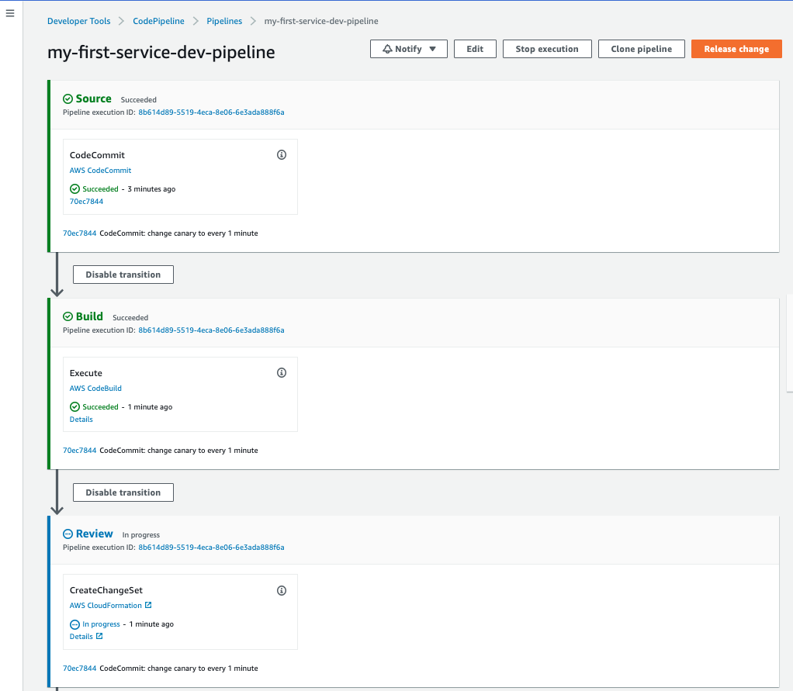

## Use at your own risk! You are responsible for where and how this is deployed. I assume no responsiblity.

# Golang Lambda Build Pipeline using CDK

The purpose of this is to create a service pipeline using AWS Lambda. We are using [ginkgo](https://onsi.github.io/ginkgo/) for testing, and [AWS SAM](https://aws.amazon.com/serverless/sam/) to create the changeset for deployment.

## Services Used
- AWS CodeCommit
- AWS CodeBuild
- AWS CodeDeploy (SAM Canary Deployments)
- AWS CodePipeline
- AWS Lambda
- AWS API Gateway

## Getting test reports in to CodeBuild

We are using [ginkgo](https://onsi.github.io/ginkgo/) to generate a jUnit Report. This report is read from the `reports` section in the `builspec`. You can view the run reports in the `Report Groups` section in `CodeBuild` 

